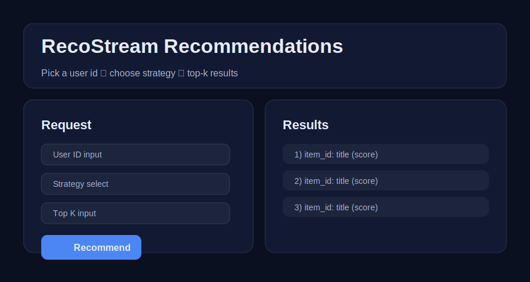

# RecoStream: End-to-End Recommendation System

RecoStream is a production-style recommendation engine designed as a real product prototype inspired by modern streaming and content platforms.  
Smart, Scalable, and Personalized Recommendations.  
It combines collaborative filtering, content intelligence, and matrix factorization to deliver personalized suggestions through a FastAPI service and a lightweight web UI.  
Built for practical learning, portfolio impact, and interview-ready storytelling.

## Problem Statement

Given a `user_id`, recommend `k` items (movies) that user is likely to enjoy.

## What’s Implemented

### Data (real dataset)

- **MovieLens 100K** ratings (`user_id`, `item_id`, `rating`, `timestamp`)
- **Movie metadata** with **genres** (used for content-based recommendations)

### Recommendation Techniques (multiple, comparable)

1. **Collaborative Filtering**
   - **User-based CF**: users with similar rating patterns get similar recommendations (cosine similarity)
   - **Item-based CF**: items similar in rating co-occurrence get recommended (cosine similarity)

2. **Content-Based Filtering**
   - Each movie is represented by a multi-hot **genre vector**
   - Similar genres imply similarity (cosine similarity over genre vectors)

3. **Matrix Factorization**
   - **SVD (TruncatedSVD)** learns latent factors from the user-item rating matrix

4. **Hybrid Recommendation**
   - Combines **collaborative** (user/item CF) with **content-based** (genres)
   - Uses a weighted blend of normalized scores

### Advanced Features (to stand out)

- **Cold-start handling**: if `user_id` is unknown, the API falls back to **popularity-based** recommendations.
- **Popularity fallback**: returns items with high average rating and enough ratings.
- **Real-time recommendation simulation (demo)**:
  - `POST /simulate` adds an interaction to an in-memory overlay and re-runs recommendations instantly.
- **Logging**:
  - API requests and recommendation events are logged to `logs/app.log`.
- **Health endpoint**:
  - `GET /health` shows model status.

## Tech Stack

- Python
- Pandas, NumPy, SciPy
- scikit-learn (cosine-nearest-neighbors + TruncatedSVD)
- FastAPI (REST backend) + simple HTML/CSS/JS frontend
- joblib (model artifacts)

## Project Structure

```text
.
├── api/
│   └── server.py
├── frontend/
│   ├── index.html
│   ├── app.js
│   └── styles.css
├── src/
│   ├── recsys.py          # core data + recommenders + engine
│   ├── train.py           # training entrypoint
│   └── evaluate.py       # RMSE + precision@k/recall@k evaluation
├── data/                  # downloaded dataset lives here
├── models/                # saved model artifacts (joblib)
├── notebooks/             # EDA + training walkthrough scripts
├── app.py                 # FastAPI entrypoint for uvicorn
├── requirements.txt
└── Dockerfile
```

## Beginner-Friendly Flow (Simple Explanation)

1. **Download + load data**
   - The dataset is fetched automatically the first time you train or start the API.
2. **Clean & preprocess**
   - Remove missing rows (basic safety checks).
   - Split interactions into train/test per user.
3. **Build the user-item matrix**
   - Rows = users, columns = movies, values = ratings.
4. **Train the recommenders**
   - CF models: cosine similarity neighbors (user/user and item/item)
   - Content model: cosine similarity over genre vectors
   - SVD model: learn latent factors from the rating matrix
5. **Evaluate**
   - `RMSE` for rating prediction quality
   - `precision@k` and `recall@k` for “did we recommend something relevant?”
6. **Serve with FastAPI**
   - `/recommend?user_id=...` returns top-10 items.
7. **Optional UI**
   - The web page calls the endpoint and shows results.

## Screenshots

These are lightweight placeholders for interview/showcase formatting:



## How to Run Locally

### 1) Install dependencies

```bash
pip install -r requirements.txt
```

### 2) Train models (build artifacts)

```bash
python -m src.train --retrain --model-path models/artifacts.joblib
```

### 3) Start the API

```bash
uvicorn app:app --reload --port 8000
```

### 4) Open the UI

- http://localhost:8000/

### 5) Example API call

```bash
curl "http://localhost:8000/recommend?user_id=1&k=10&strategy=hybrid&exclude_seen=true"
```

## Model Evaluation (Compare Approaches)

Run:

```bash
python -m src.evaluate --output reports/eval.json --k 10
```

This creates a JSON file with:

- RMSE for each strategy
- precision@k and recall@k (treats ratings >= 4 as “relevant”)

## Docker Support

Build:

```bash
docker build -t shyft-recsys .
```

Run:

```bash
docker run --rm -p 8000:8000 shyft-recsys
```

Notes:
- The container is configured to auto-train if `models/artifacts.joblib` does not exist.

## Deployment (Render / Railway / Spaces)

Recommended approach:
1. Start the app with `AUTO_TRAIN=true` (default).
2. Ensure the instance has enough CPU/RAM for a one-time training run.
3. For faster startups later, run training once and commit or upload `models/artifacts.joblib` to persistent storage (provider-dependent).

## Future Improvements

- Scale to larger datasets with faster approximate nearest neighbors (FAISS / Annoy)
- Use more realistic implicit feedback (clicks/purchases) and implicit losses
- Add caching (top-k results) per user
- Add proper Prometheus metrics endpoint
- Add offline recommendation logging with dataset versioning

